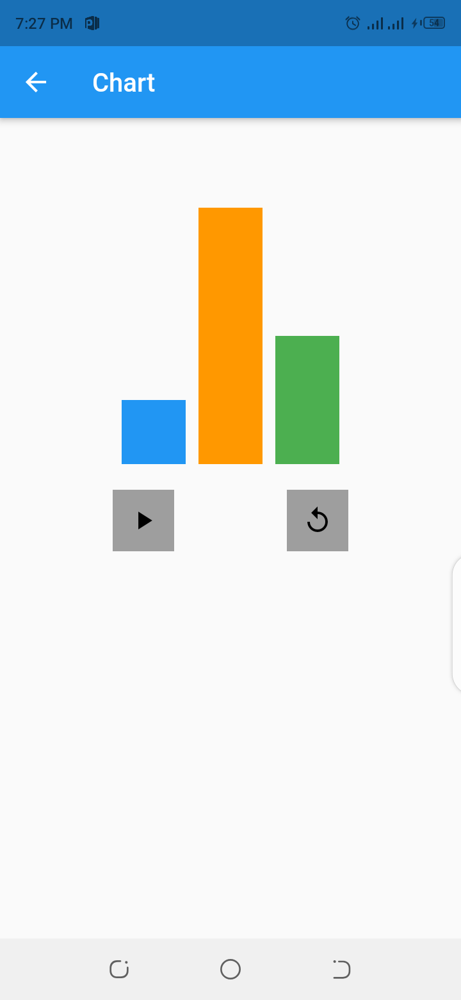

<h1>Flutter Implicit Animations</h1>

A flutter project using all implicit animations courtesty of <a href="https://medium.com/flutter-community/flutter-animation-easy-way-of-learning-the-flutter-implicit-animation-widgets-pt-1-712f2b78f6b5">Joshua de Guzman</a> from the flutter community on medium The flutter

The Animations provided are:

<ul>
<li>Animation Container Widget</li>
<li>Animated Cross Fade Widget</li>
<li>Animated Position</li>
<li>Animated Opacity</li>
<li>Animated phyical model</li>
</ul>

<h3>Animated Container</h3> 
  
<h3>Animated Chart</h3> 
  